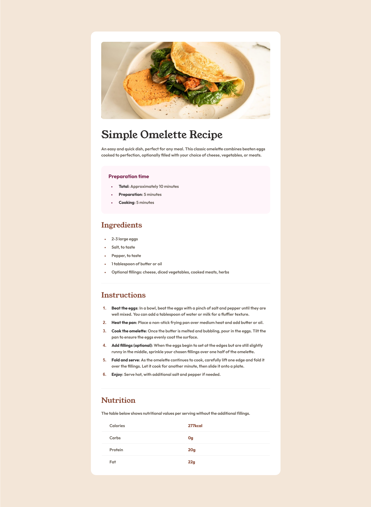

# Frontend Mentor - Recipe page solution

This is a solution to the [Recipe page challenge on Frontend Mentor](https://www.frontendmentor.io/challenges/recipe-page-KiTsR8QQKm).

### Screenshot

### Links

- Solution URL: [Solution URL here](https://www.frontendmentor.io/solutions/recipe-page-aQsGPiRQ3b)
- Live Site URL: [Live site URL here](https://tuhin-jr.github.io/Frontend-Mentor---Recipe-page-solution/)

### Built with

- Semantic HTML5 markup
- CSS custom properties
-

## Author

- Frontend Mentor - [@Tuhin-jr](https://www.frontendmentor.io/profile/Tuhin-jr)
